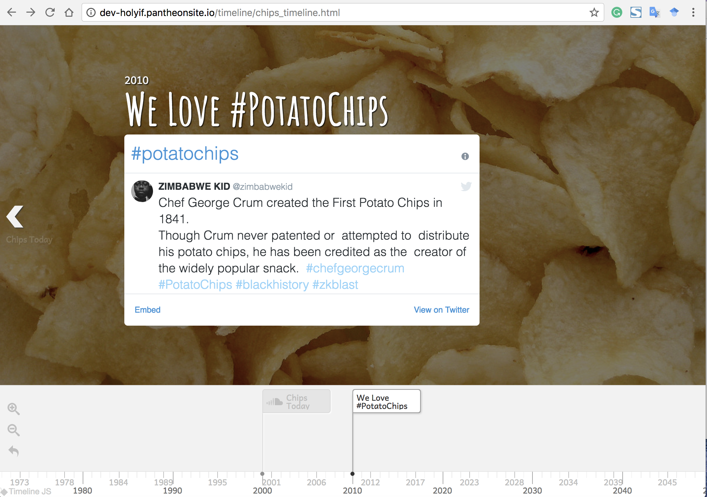

# 9th assignment
<h2><a href="http://dev-holyif.pantheonsite.io/map3/"> The inclass exercise: Map </a></h2>

 For a test, I delete Taiwan.

<h2><a href="http://dev-holyif.pantheonsite.io/timeline/chips_timeline.html">Timeline of potato chips</a></h2>

 I once saw an article about the history of potato chips, which is interesting. Based on it, I make this timeline, using different media types including <strong>Images, Soundcloud, Google Map, Youtube video, Wikipedia, and a Twitter embedded code.</strong>

<b>Report and question:<b>
 At the last time point, I used a Twitter embedded code to present the tweets with hashtag #potatochips, because the Timeline JS only support the url of specific twitter account or tweet, not hashtag page.
 It is stable until I upload to drupal (see the screenshots). When I check the timeline, it didn't show. But when I refresh the page, it successfully showed the effect I want.

 I have tried many ways to fix this bug, but all did not work. I didn't know it is because of the limit of Twitter or anything else. Can you give me any advice on it?
